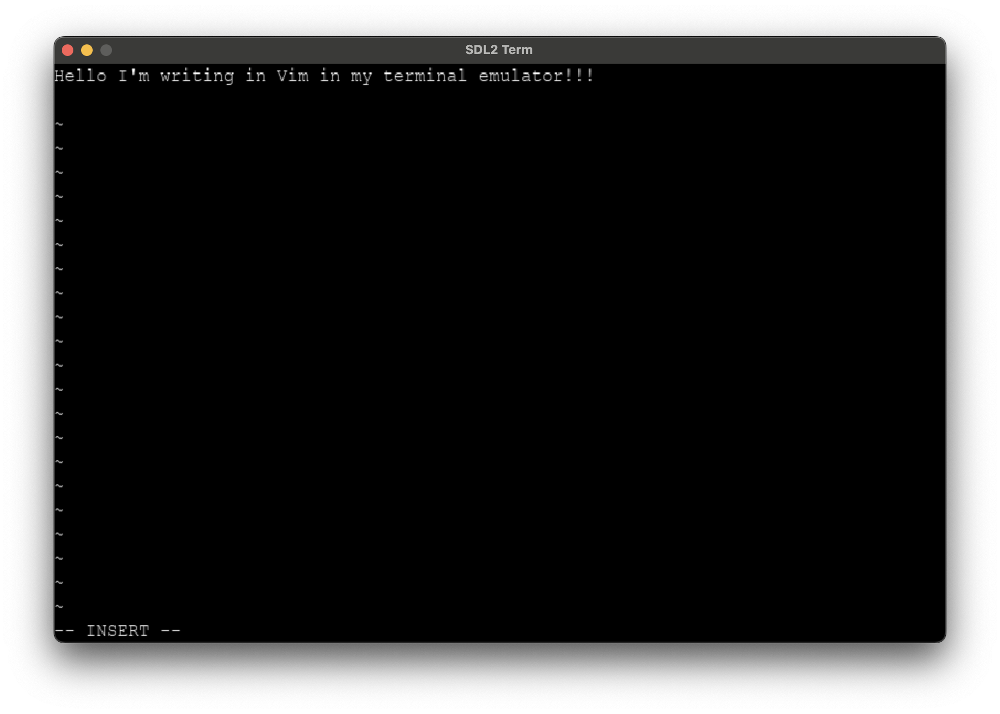
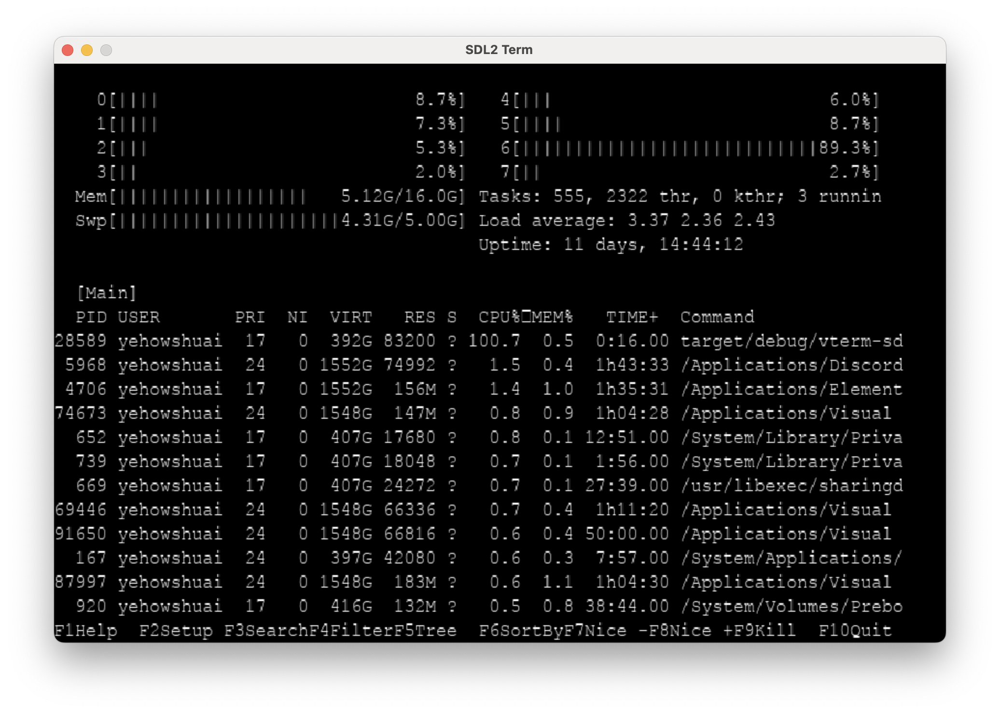

# About

Example codebase demoing implementing a terminal emulator in Rust.
This implementation is notably quite inefficient!!!

You can use this implementation as a reference for how to use Alacritty
as a terminal backend.





## Status
This terminal emulator is able to handle control sequences and applications
that make regular use of partial re-draws such as `vim` or `htop`. This application
is however missing some features such as drawing a cursor. Furthermore, the current
implementation is quite innefficient as it redraws the entire screen everytime
instead of only damaged areas.

## Why Use the `alacritty` Library?

Building a terminal emulator involves more than simply printing program output to the screen. A true emulator needs to manage detailed screen states, cursor positions, control sequences, and various text attributes. Many terminal-based programs, such as `vim` or `htop`, redraw specific parts of the screen and use ANSI escape sequences to format text dynamically.

Using `alacritty` as the backend provides several advantages:
- **Comprehensive Screen State Management**: `alacritty` manages cursor positioning, scrolling, screen clearing, and other complex screen states automatically.
- **Control Sequence Handling**: It interprets ANSI control sequences for text formatting, cursor movement, color, and other terminal features, enabling realistic behavior.
- **Reliability**: Leveraging a widely-used library avoids the need to reimplement these complex behaviors from scratch, increasing reliability and consistency.

# Status
Screen content toggles when you press space.

# Building
## MacOS
```bash
brew install sdl2 sld2_ttf
cargo run
```

## Ubuntu
```bash
apt install libsdl2-ttf-dev libsdl2-dev libclang-dev clang pkg-config curl build-essential -y
curl --proto '=https' --tlsv1.2 -sSf https://sh.rustup.rs | sh
git clone https://github.com/ThePerfectComputer/alacritty-sdl2-term-rs.git
cd alacritty-sdl2-term-rs
cargo run
```

# TODO

 - [x] Matrix to SDL display
 - [ ] Address warnings?
 - [x] Handle control sequences.
 - [ ] Make into library?
 - [ ] Handle escape sequence properly...
 - [x] Remove VTerm dependency once I have successfully
       demonstrated basic ATerm in SDL2.